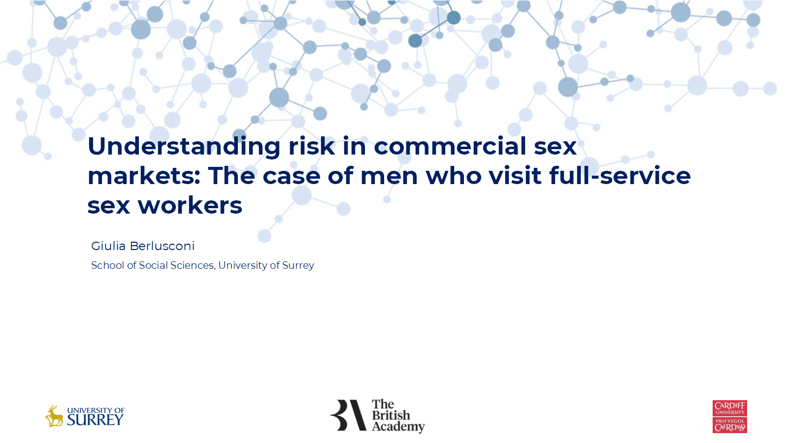

Learn about the key findings from the study by taking a look at the presentation shared during the online event that took place on Friday, 1st November.

How do men who engage with and visit full-service sex workers understand and perceive law enforcement risk associated with it? To what extent do changes in legislation may impact on their willingness to visit service providers? Under what circumstances may clients become ‘accountable active participants’ in commercial sex markets?

[Take a look at the presentation](../assets/event_01112024_pdf.pdf) shared by [Dr Giulia Berlusconi](https://www.surrey.ac.uk/people/giulia-berlusconi) during the online event that took place on Friday, 1st November.
